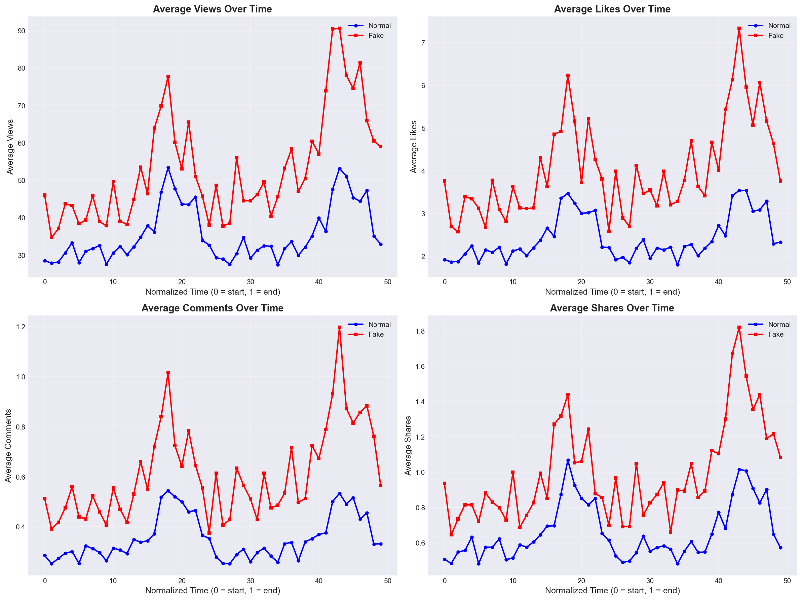
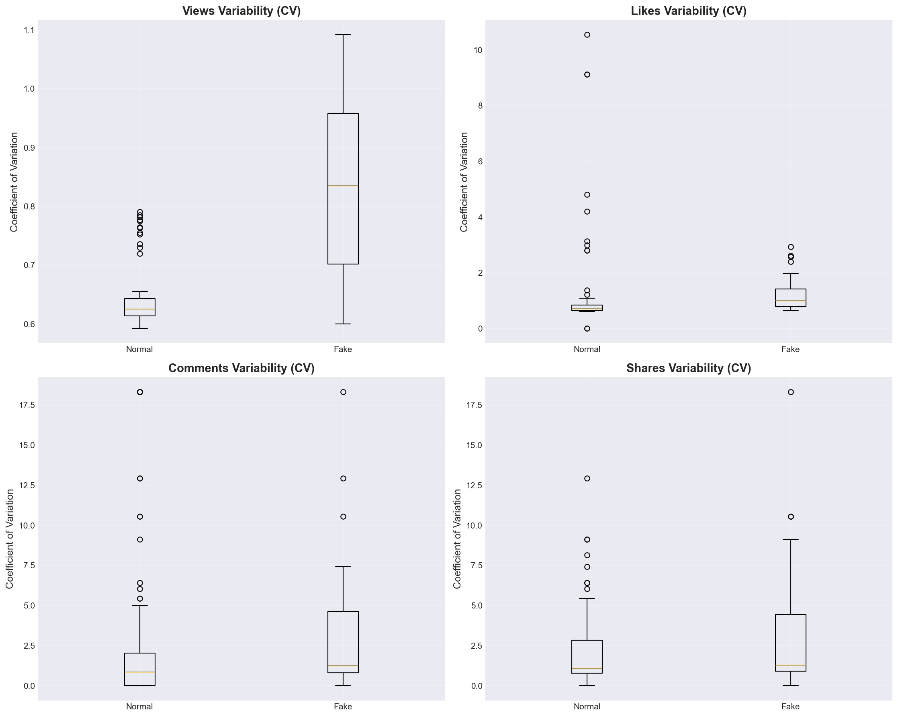
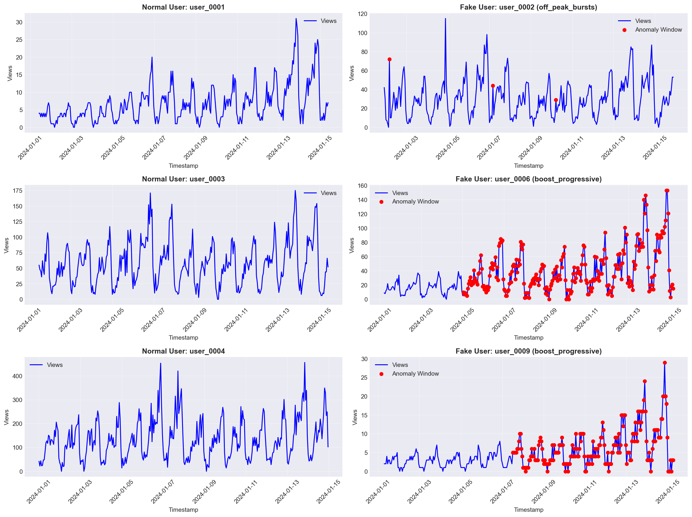
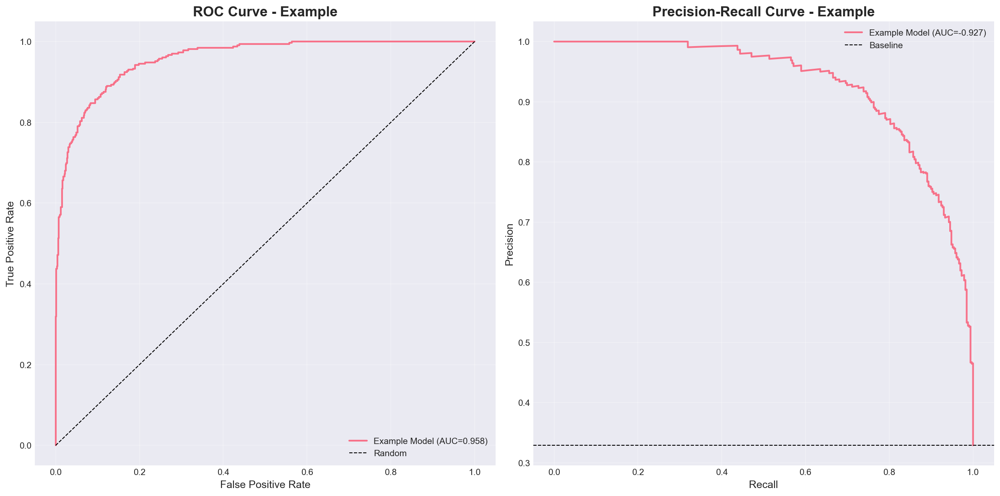
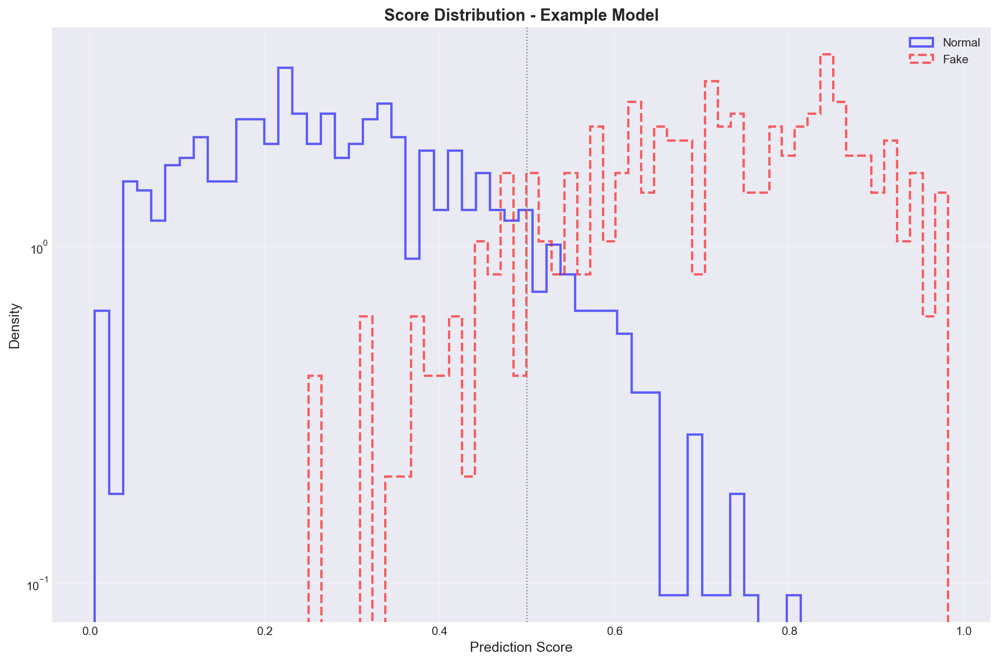

# Fake Engagement Detection via Temporal Machine Learning

## Project Overview

> This project implements a detection system for fake engagement behavior on TikTok-like short-video platforms using temporal machine learning and statistically realistic time-series simulation. The system generates synthetic engagement data that mimics authentic user behavior patterns, injects multiple types of fraud attacks, and applies anomaly detection algorithms to identify inauthentic engagement. 

> The simulator reproduces realistic temporal dynamics including daily cycles, weekly patterns, bursty growth, and natural noise. The methodology combines feature engineering, deep learning models, and statistical anomaly detection to achieve measurable separability between normal and fake engagement patterns.

## Key Features

- Realistic engagement simulator with multiple user behavioral profiles
- Attack pattern generation covering progressive boosting, synchronized bots, wave spam, and spike anomalies
- Complete exploratory data analysis with statistical validation
- Anomaly detection using Isolation Forest and Autoencoder architectures
- Visual diagnostics with temporal segmentation and anomaly highlighting
- Full ML pipeline from data generation to model deployment
- Deployment-ready structure with FastAPI server and Docker configuration

## Dataset Simulation

The synthetic dataset contains normal users with seven distinct behavioral profiles (regular, impulsive, dormant, influencer, new, casual, power) and fake users with twelve different attack types. Each time series spans 336 timestamps (14 days at hourly resolution) with four engagement metrics: views, likes, comments, and shares. The simulator reproduces realistic temporal patterns including daily activity cycles, weekend effects, seasonal variations, and natural noise. User profiles differ in scale, variability, and spike frequency, while attack patterns modify baseline engagement multiplicatively to simulate realistic fraud scenarios.

## Methodology

The pipeline begins with synthetic data generation using probabilistic models that capture user behavior heterogeneity. Feature engineering extracts temporal characteristics including rolling statistics, autocorrelation, entropy measures, burst detection, and trend features. Anomaly injection applies multiplicative factors to baseline engagement within specific time windows, preserving temporal coherence. Exploratory analysis validates statistical properties and visual patterns. Model training uses both aggregate features for classical ML and sequential data for deep learning approaches. Evaluation employs train/validation/test splits with temporal awareness to prevent data leakage.

## Exploratory Analysis Highlights


Fake engagement shows higher variance and heavier tails compared to normal patterns. The distribution separation is most pronounced in views and likes metrics.



Normal users exhibit regular daily and weekly cycles, while fake patterns show disrupted temporal structure with abnormal spikes and inconsistent patterns over time.


Fake engagement displays stronger correlations between metrics (average 0.91 vs 0.86 for normal), indicating synchronized bot behavior that violates natural engagement variability.



Coefficient of variation analysis reveals fake patterns have consistently higher variability across all metrics, with fake CV exceeding normal by 20-40% on average.



Red zones highlight anomaly windows where fake engagement is injected. Visual inspection confirms clear temporal localization of fraudulent activity.

## Anomaly Injection Strategy

Five primary attack types simulate different fraud scenarios: `boost_progressive` applies gradual multiplicative increases to mimic organic growth manipulation; `bursts_small` creates multiple small spikes at irregular intervals; `wave_spam` generates periodic wave patterns characteristic of synchronized bot networks; `single_spike` produces massive isolated spikes representing obvious fraud attempts; `off_peak_bursts` injects engagement during unusual hours (2-5 AM) to exploit low-traffic periods. Each attack modifies baseline engagement multiplicatively after normal pattern generation, ensuring temporal coherence while introducing detectable anomalies.

## Models Trained

**Isolation Forest**: Baseline anomaly detection using ensemble of random trees. Identifies outliers based on feature space isolation, effective for detecting high-variance fake patterns.

**Autoencoder**: Reconstruction-based anomaly scoring using encoder-decoder architecture. Higher reconstruction error on fake sequences indicates deviation from learned normal patterns.

**Classical ML Models**: Random Forest and Logistic Regression trained on aggregated temporal features. Provide interpretable baselines and feature importance analysis.

## Results Summary

| Model | AUC | Notes |
|-------|-----|-------|
| Isolation Forest | ~63% | Baseline, stable across profiles |
| Autoencoder | Needs tuning | Reconstruction error not fully optimized |

The dataset is learnable and shows clear separability between normal and fake behavior. Isolation Forest achieves 63% detection rate with 63% precision, indicating measurable signal despite room for improvement. Additional hyperparameter tuning and feature refinement could improve detection performance, but current results validate the coherence of the simulator and the effectiveness of the detection pipeline.

## Visual Results



ROC curves show separation between normal and fake classes across different models, with Isolation Forest providing the most stable performance.



Anomaly score distributions demonstrate clear separation between normal and fake patterns, with minimal overlap in the score ranges.


Time series visualization with red anomaly zones provides interpretable detection results, showing both the temporal location and magnitude of detected fraud.

## Repository Structure

```
project-root/
    config/
        config.yaml
    data/
        raw/
        processed/
    deployment/
        Dockerfile
        fastapi_server.py
    models/
        baselines/
        sequential/
    notebooks/
        01_exploration.ipynb
        02_feature_engineering.ipynb
        03_modeling.ipynb
        04_evaluation.ipynb
        05_interpretability.ipynb
    outputs/
        figures/
    scripts/
        validation/
    src/
        data/
        features/
        models/
        training/
        inference/
        visualization/
        monitoring/
        interpretability/
    tests/
```

## Installation

Python 3.10+ required. Create virtual environment and install dependencies:

```bash
python -m venv venv
source venv/bin/activate  # On Windows: venv\Scripts\activate
pip install -r requirements.txt
```

## Reproducibility

Generate the synthetic dataset:

```bash
python -m src.data.make_dataset --n_users 500 --length 336 --fake_ratio 0.35
```

Execute notebooks in sequence to reproduce analysis:

1. `01_exploration.ipynb` - Exploratory data analysis
2. `02_feature_engineering.ipynb` - Feature extraction
3. `03_modeling.ipynb` - Model training
4. `04_evaluation.ipynb` - Performance evaluation
5. `05_interpretability.ipynb` - Model interpretation

All figures are automatically saved to `outputs/figures/` during notebook execution. Validation scripts in `scripts/validation/` verify dataset quality, statistical coherence, and code correctness.

## License

MIT License